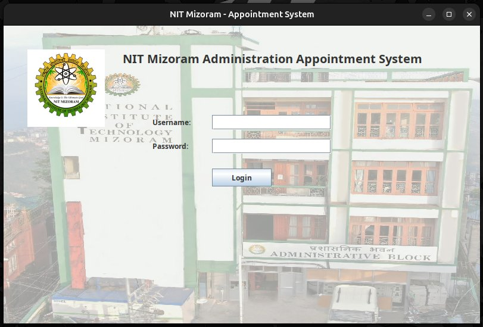
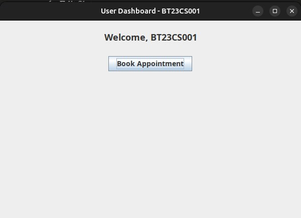
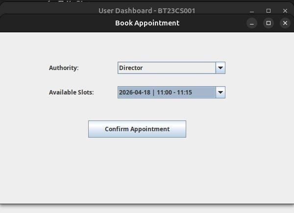
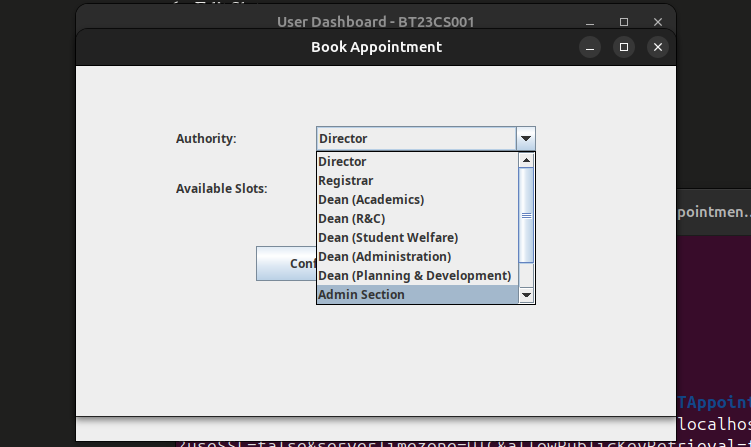
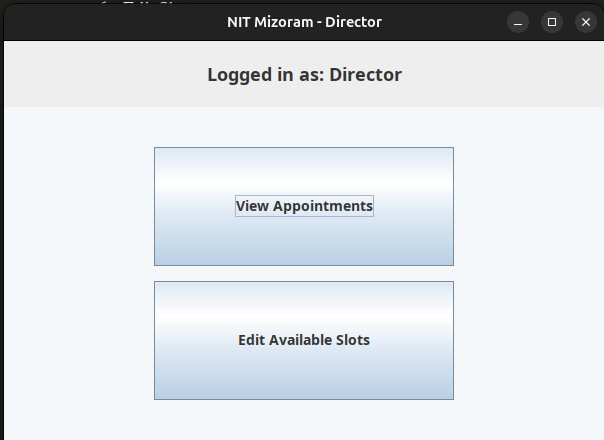
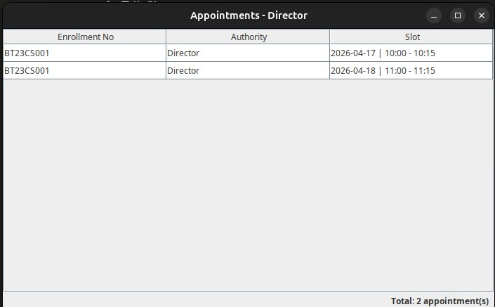
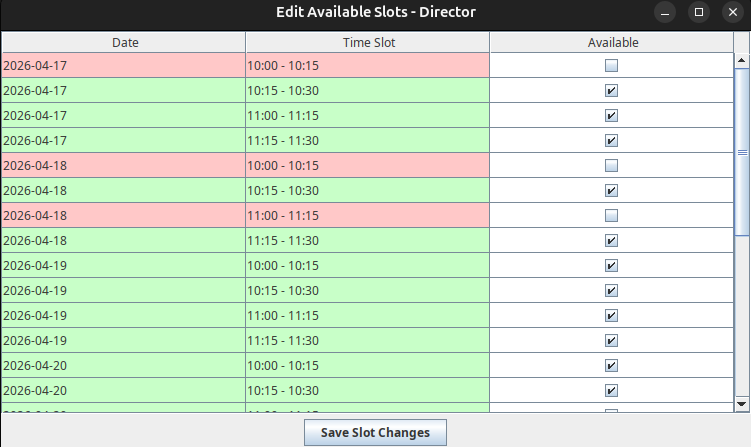
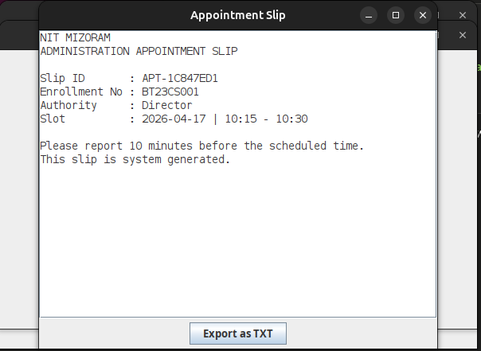

# NIT Mizoram Administration Appointment System

> **A Java Swing desktop application** built during my 2nd semester at NIT Mizoram, where Object-Oriented Programming introduced me to the world of Java, and a chance encounter with Swing/AWT sparked an idea to solve a real campus problem: unorganized and unstructured appointment visits to the administration building.

---

## The Story Behind This Project

During my early days at NIT Mizoram, visiting the administration building was always a frustrating experience, long queues, no clear system, students waiting without knowing when (or if) they'd be seen. There was no structure, no tracking, no confirmation of any kind.

That same semester, we were introduced to **Object-Oriented Programming** in Java. When I discovered **Java Swing and AWT**, I was fascinated, the idea that you could build real, interactive desktop applications with Java felt like a superpower. So I decided to build something that actually solved a problem I was living every day.

This project was built almost entirely during that 2nd semester. The core logic, UI, slip generation with unique IDs, all of it was done back then. The only piece missing was a real database. Months later, I came back and integrated **MySQL** to make it fully persistent.

Every appointment slip generated carries a **unique ID** (`APT-XXXXXXXX`) along with the date and authority- making each slip traceable and one-of-a-kind.

---

## Features

- **Student login** - book appointments with any administrative authority
- **Authority login** - view booked appointments, manage available slots
- **MySQL-backend** - all data persists across sessions
- **Appointment slip** - generates a unique TXT slip saved to Desktop
- **Unique Slip ID** - every slip gets a UUID-based ID (e.g. `APT-3F8A92BC`) making it distinct and traceable
- **Role-based access** - separate dashboards for students and authorities
- **Auto slot seeding** - if no slots exist for an authority, the system seeds 7 days × 4 time slots automatically

---

## Screenshots

> _Login Screen: NIT Mizoram Administration Appointment System with the actual Administrative Block in the background_



---

> _Student Dashboard: Welcome screen after student login_



---

> _Book Appointment: Select authority and available time slot_



---

> _Authority Dropdown: All supported administrative authorities_



---

> _Appointment Slip: Unique slip ID generated (APT-AFB4F879) with date and authority details_



---

> _Authority Dashboard: Director's dashboard with View and Edit options_



---

> _View Appointments: All booked appointments visible to the authority_



---

> _Edit Slots: Colour-coded slot management (green = available, red = booked)_


---

> *Appointment Slip Window: System-generated slip with unique ID, enrollment number, authority and slot details*



---

## Supported Authorities

| Username | Dashboard Role |
|---|---|
| `director` | Director |
| `registrar` | Registrar |
| `dean` | Dean (all sub-categories) |
| `admin` | Admin Section |
| `finance` | Finance Section |
| `erp` | ERP Section |

Student accounts follow the pattern: `BT<YY><BRANCH><NNN>` (e.g. `BT23CS001`)

---

## Project Structure

```
NITAppointmentSystem/
├── database/
│   └── schema.sql              ← Run this first to create DB + seed data
├── lib/
│   ├── openpdf-1.3.30.jar
│   └── mysql-connector-j-*.jar ← Download separately (see below)
├── src/
│   ├── App.java
│   ├── model/
│   │   ├── Appointment.java
│   │   └── User.java
│   ├── ui/
│   │   ├── LoginFrame.java
│   │   ├── UserDashboard.java
│   │   ├── AuthorityDashboard.java
│   │   ├── BookAppointmentFrame.java
│   │   ├── ViewAppointmentsFrame.java
│   │   ├── EditSlotsFrame.java
│   │   └── AppointmentSlipFrame.java
│   └── util/
│       ├── DBConnection.java
│       ├── AppointmentDAO.java
│       ├── Slot.java
│       └── TextSlipGenerator.java
├── .env.example
├── .gitignore
└── README.md
```

---

## Prerequisites

| Tool | Version |
|---|---|
| Java JDK | 11 or higher |
| MySQL | 8.0 or higher |
| MySQL Connector/J | 8.x (JDBC driver) |

---

## Setup Instructions

### 1. Clone the repository

```bash
git clone https://github.com/thenamanshukla/NITMzAppointmentSystem-Java.git
cd NITMzAppointmentSystem-Java
```

### 2. Set up the database

```bash
mysql -u root -p < database/schema.sql
```

This creates the `nit_appointment` database with all tables and seed user accounts.

### 3. Download the JDBC driver

Download **MySQL Connector/J** from:
https://dev.mysql.com/downloads/connector/j/

Place the `.jar` file inside the `lib/` folder:
```
lib/mysql-connector-j-8.x.x.jar
```

### 4. Create a MySQL user for the app

```bash
sudo mysql
```

```sql
CREATE USER 'nitapp'@'localhost' IDENTIFIED WITH mysql_native_password BY 'YourPassword@123';
GRANT ALL PRIVILEGES ON nit_appointment.* TO 'nitapp'@'localhost';
FLUSH PRIVILEGES;
EXIT;
```

### 5. Compile

```bash
mkdir -p bin
javac -cp "lib/*" -d bin src/App.java src/model/*.java src/ui/*.java src/util/*.java
cp -r src/resources bin/
```

### 6. Run

```bash
# macOS / Linux
DB_USER=nitapp DB_PASS="YourPassword@123" \
DB_URL="jdbc:mysql://localhost:3306/nit_appointment?useSSL=false&serverTimezone=UTC&allowPublicKeyRetrieval=true" \
java -cp "bin:lib/*" App

# Windows
set DB_USER=nitapp
set DB_PASS=YourPassword@123
set DB_URL=jdbc:mysql://localhost:3306/nit_appointment?useSSL=false&serverTimezone=UTC&allowPublicKeyRetrieval=true
java -cp "bin;lib/*" App
```

---

## Default Login Credentials

>  Change these passwords in the database before deploying.

| Role | Username | Password |
|---|---|---|
| Director | `director` | `admin123` |
| Registrar | `registrar` | `admin123` |
| Dean | `dean` | `admin123` |
| Admin | `admin` | `admin123` |
| Finance | `finance` | `admin123` |
| ERP | `erp` | `admin123` |
| Student | `BT23CS001` | `student123` |

---

## Database Schema

```
users          — login credentials and roles (student / authority)
slots          — available appointment time windows per authority
appointments   — confirmed bookings linked to slots, each with a unique slip ID
```

Full schema: [`database/schema.sql`](database/schema.sql)

---

## Tech Stack

| Layer | Technology |
|---|---|
| Language | Java (JDK 11+) |
| GUI Framework | Java Swing + AWT |
| Database | MySQL 8.0 |
| DB Connectivity | JDBC (MySQL Connector/J 8.x) |
| Slip Export | Plain text (FileWriter) |
| PDF Library | OpenPDF 1.3.30 (included, PDF export planned) |

---

## How the Slip ID Works

Every confirmed appointment generates a slip ID in the format:

```
APT-3F8A92BC
```

This is derived from a `UUID.randomUUID()`  truncated to 8 characters and uppercased. Combined with the date and authority name on the slip, it makes every appointment uniquely identifiable and verifiable.

---

## Contributing

1. Fork the repo
2. Create a feature branch: `git checkout -b feature/your-feature`
3. Commit your changes: `git commit -m "Add your feature"`
4. Push and open a Pull Request

---

## License

MIT License - see [LICENSE](LICENSE) for details.

This is a personal project developed by **Naman Shukla** during his **2nd Semester, B.Tech** at **NIT Mizoram (National Institute of Technology Mizoram)** self-initiated, born out of a real campus problem faced by the developer himself.
